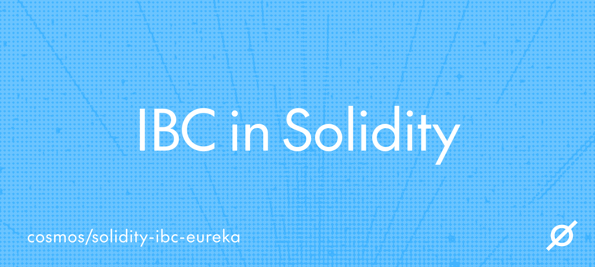

# IBC in Solidity



<div align="center">
  <a href="https://github.com/cosmos/ibc-contracts/releases/latest">
    
  </a>
  <a href="https://www.apache.org/licenses/LICENSE-2.0">
    
  </a>
  <a href="https://codecov.io/github/cosmos/ibc-contracts">
    
  </a>
  <a href="https://github.com/cosmos/ibc-contracts/actions/workflows/e2e-full.yml">
    
  </a>
  <a href="https://github.com/cosmos/ibc-contracts/actions/workflows/e2e-minimal.yml">
    
  </a>
  <a href="https://getfoundry.sh/">
    
  </a>
  <!--
  Cosmos requires three badges directly below the title: License, OpenSSF Best
  Practices, and OpenSSF Scorecard. Only License is present above. The other two
  are commented out because both would currently render as an error, which is
  worse than a missing badge. Each needs a prerequisite done first, not just an
  uncomment.

  OpenSSF Scorecard: api.scorecard.dev returns "invalid repo path" for this
  repository, because there is no Scorecard workflow publishing results. Add
  .github/workflows/scorecard.yml (ibc-go has one and scores 6.8), wait for the
  first scheduled run, then uncomment this.

  <a href="https://scorecard.dev/viewer/?uri=github.com/cosmos/ibc-contracts">
    
  </a>

  OpenSSF Best Practices: the project is not registered at
  https://www.bestpractices.dev/ — a search returns nothing for either name.
  Register it, then uncomment this and substitute the real id. Do not guess an
  id: a badge pointing at a nonexistent project renders as an error.

  <a href="https://bestpractices.coreinfrastructure.org/projects/PROJECT_ID">
    
  </a>

  Not carried over from ibc-go: the GoDoc and Go report card badges, which cover
  a published Go library. The only Go here is the end-to-end test module.

  Also note the License badge above is a static shields badge, not ibc-go's
  dynamic img.shields.io/github/license/... one. The dynamic badge renders
  "license: not identifiable by github" for this repository, because GitHub's
  license detection does not pick up LICENSE.md.
  -->
</div>

This is an implementation of IBC v2 in Solidity and Solana. IBC v2 is a simplified version of the IBC protocol that is encoding agnostic. This enables a trust-minimized IBC connection between Ethereum and a Cosmos SDK chain.

## Overview

`ibc-contracts` is an implementation of IBC in Solidity.

- [IBC in Solidity](#ibc-in-solidity)
  - [Overview](#overview)
    - [Project Structure](#project-structure)
    - [Solidity Contracts](#solidity-contracts)
    - [SP1 Programs for the Light Client](#sp1-programs-for-the-light-client)
    - [Solana Programs](#solana-programs)
  - [Build Requirements](#build-requirements)
    - [Ethereum Requirements](#ethereum-requirements)
    - [Solana Requirements](#solana-requirements)
  - [Unit Testing](#unit-testing)
  - [End to End Testing](#end-to-end-testing)
    - [Requirements](#requirements)
    - [Running the tests](#running-the-tests)
  - [Development](#development)
  - [End to End Benchmarks](#end-to-end-benchmarks)
    - [Single Packet Benchmarks](#single-packet-benchmarks)
    - [Aggregated Packet Benchmarks](#aggregated-packet-benchmarks)
  - [Security Assumptions](#security-assumptions)
    - [Handling Frozen Light Clients](#handling-frozen-light-clients)
    - [Security Council and Governance Admin](#security-council-and-governance-admin)
      - [Admin Powers and Restrictions](#admin-powers-and-restrictions)
      - [Key Distinction Between Admins](#key-distinction-between-admins)
    - [Roles and Permissions](#roles-and-permissions)
  - [Releases](#releases)
  - [Contributing](#contributing)
  - [Community and governance](#community-and-governance)
  - [Adopters](#adopters)
  - [License](#license)
  - [Acknowledgements](#acknowledgements)

### Project Structure

This project is structured with the following directories:

- `ibc-solidity/`: Contains the Solidity implementation of IBC and its related light-client programs.
    - `solidity.just`: Contains the namespaced `just solidity::...` development recipes.
    - `contracts/`: Contains the Solidity contracts.
    - `test/`: Contains the Solidity tests.
    - `scripts/`: Contains Solidity scripts and tools.
    - `abi/`: Contains the ABIs of the contracts needed for end-to-end tests.
    - `programs/`: Contains Rust programs maintained alongside the Solidity implementation.
        - `sp1-programs/`: Contains the SP1 programs for the Tendermint light client.
        - `cw-ics08-wasm-eth/`: Contains the `CosmWasm` light client for Ethereum.
        - `operator/`: Contains the fixture generator for the SP1 light client.
- `ibc-solana/`: Contains the Solana IBC implementation.
    - `solana.just`: Contains the namespaced `just solana::...` development recipes.
    - `programs/`: Contains the Anchor programs.
    - `packages/`: Contains shared Solana IBC Rust crates.
    - `integration-tests/`: Contains the Solana integration-test workspace.
- `docs/`: Contains the ADRs and audits for the project.
- `scripts/`: Contains repository-wide scripts and tools.
- `e2e/`: Contains the end-to-end tests, powered by [interchaintest](https://github.com/strangelove-ventures/interchaintest).
- `programs/`: Contains the Rust programs for the project.
    - `proof-api/`: Contains the proof API implementation.
- `packages/`: Contains the Rust packages for the project.
  - `go-abigen/`: Contains the abi generated go files for the Solidity contracts.
- `tools/`: Contains various tools used for testing.

### Solidity Contracts

| **Contracts** | **Description** | **Status** |
|:---:|:---:|:---:|
| `ICS26Router.sol` | IBC router handles sequencing, replay protection, and timeout checks. Passes proofs to light clients for verification, and resolves `portId` for app callbacks. Provable IBC storage is stored in this contract.  | ✅ |
| `ICS20Transfer.sol` | IBC transfer application to send and receive tokens to/from another IBC transfer implementation. | ✅ |
| `SP1ICS07Tendermint.sol` | Tendermint light client powered by SP1. The entry point for SP1 proofs. | ✅ |
| `ICS27GMP.sol` | IBC General Message Passing via Interchain Accounts. | ✅ |
| `AttestationLightClient.sol` | The multisig contract implementing IBC Light Client specs. | ✅ |
| `utils/IFTBaseUpgradeable.sol` | Interchain Fungible Token standard. Mint and burn alternative to ICS-20. | ⏳ |

### SP1 Programs for the Light Client

|     **Programs**    |                                                                                                                                     **Description**                                                                                                                                     | **Status** |
|:-------------------:|:---------------------------------------------------------------------------------------------------------------------------------------------------------------------------------------------------------------------------------------------------------------------------------------:|:----------:|
|   `update-client`   | Once the initial client state and consensus state are submitted, future consensus states can be added to the client by submitting IBC Headers. These headers contain all necessary information to run the Comet BFT Light Client protocol. Also supports partial misbehavior check.     |      ✅     |
|     `membership`    | As consensus states are added to the client, they can be used for proof verification by relayers wishing to prove packet flow messages against a particular height on the counterparty. This uses the `verify_membership` and `verify_non_membership` methods on the tendermint client. |      ✅     |
| `uc-and-membership` | This is a program that combines `update-client` and `membership` to update the client, and prove membership of packet flow messages against the new consensus state.                                                                                                                    |      ✅     |
|    `misbehaviour`   | In case, the malicious subset of the validators exceeds the trust level of the client; then the client can be deceived into accepting invalid blocks and the connection is no longer secure. The tendermint client has some mitigations in place to prevent this.                       |      ✅     |

### Solana Programs

| **Programs** | **Description** | **Status** |
|:---:|:---:|:---:|
| `access-manager` | A central contract to store the permissions of a system. | ✅ |
| `attestation` | The multisig contract implementing IBC Light Client specs. | ✅ |
| `ics07-tendermint` | ICS-07 tendermint light client, powered by tendermint-rs | ✅ |
| `ics26-router` | IBC router handles sequencing, replay protection, and timeout checks. Passes proofs to light clients for verification, and resolves `portId` for app callbacks. Provable IBC storage is stored in this contract. | ✅ |
| `ics27-gmp` | IBC General Message Passing via Interchain Accounts. | ✅ |
| `ift` | Interchain Fungible Token standard. Mint and burn alternative to ICS-20. | ⏳ |

## Build Requirements

### Ethereum Requirements

- [Rust](https://rustup.rs/)
- [Foundry](https://book.getfoundry.sh/getting-started/installation)
- [Bun](https://bun.sh/)
- [Just](https://just.systems/man/en/)
- [SP1](https://docs.succinct.xyz/docs/sp1/getting-started/install) (_Note: Homebrew installations of rust may fail here_)
- [Protobuf compiler](https://grpc.io/docs/protoc-installation/)

Foundry typically uses git submodules to manage contract dependencies, but this repository uses Node.js packages (via Bun) because submodules don't scale. You can install the contracts dependencies by running the following command:

```sh
cd ibc-solidity && bun install
```

You also need to have the operator and proof API binaries installed on your machine to run some of the end-to-end tests. You can install them by running the following commands:

```sh
just install-operator
just install-proof-api
```

> [!TIP]
> Nix users can enter a development shell with all the necessary dependencies by running:
>
> ```sh
> nix develop
> ```

### Solana Requirements

- [Rust 1.89.0](https://rustup.rs/) (selected automatically by `ibc-solana/rust-toolchain.toml`)
- [Anchor](https://www.anchor-lang.com/docs/installation)
- [Agave](https://www.anchor-lang.com/docs/installation)
- [Just](https://just.systems/man/en/)

If you have Anchor installed locally, you can use the standard commands:

```sh
just solana::build-solana-programs
just solana::test-solana
```

List every Solana-specific recipe with:

```sh
just solana
```

Or directly:

```sh
cd ibc-solana
anchor build
anchor test
anchor deploy
```

> [!TIP]
> Nix users can enter a solana development shell with all the necessary dependencies by running:
>
> ```sh
> nix develop .#solana
> ```
>
> Then navigate to the Solana programs directory and use anchor-nix commands:
>
> ```sh
> cd ibc-solana
> anchor-nix build
> anchor-nix test
> anchor-nix deploy
> ```

### Solana Programs

For detailed information about Solana IBC programs including deployment, key generation, access control, and upgradability, see the **[Solana Programs README](ibc-solana/README.md)**.

## Unit Testing

There are multiple unit tests for the solidity contracts located in the `ibc-solidity/test/` directory. The tests are written in Solidity using [foundry/forge](https://book.getfoundry.sh/forge/writing-tests).

To run all the tests, run the following command:

```sh
just solidity::test-foundry
```

The recipe also accepts a `testname` argument that will only run the test with the given name. For example:

```shell
just solidity::test-foundry test_success_sendTransfer
```

## End to End Testing

There are several end-to-end tests in the `e2e/interchaintestv8` directory. These tests are written in Go and use the [`interchaintest`](https://github.com/strangelove-ventures/interchaintest) library.
It spins up a local Ethereum and a Tendermint network and runs the tests found in [`e2e/interchaintestv8/ibc_eureka_test.go`](e2e/interchaintestv8/ibc_eureka_test.go).
Some of the tests use the prover network to generate the proofs, so you need to provide your SP1 network private key to `.env` for these tests to pass.

### Requirements

- [Go](https://go.dev/doc/install)
- [Docker](https://docs.docker.com/get-docker/)
- [Kurtosis](https://docs.kurtosis.com/install/)
  - Needs to be the same version as `github.com/kurtosis-tech/kurtosis/api/golang` dependency in e2e [`go.mod`](./e2e/interchaintestv8/go.mod) file.

To prepare for running the e2e tests, you need to make sure you have done the following:
- Set up an .env file (see the instructions in the `.env.example` file)
- If you have made changes to the contract interfaces or types, you need to update the ABIs by running `just solidity::generate-abi`

> [!NOTE]
> If you are running on a Mac with an M chip, you will need to do the following:
>
> - Set up Rosetta
> - Enable Rosetta for Docker (in Docker Desktop: Settings -> General -> enable "Use Rosetta for x86_64/amd64 emulation on Apple Silicon")
> - Pull the foundry image with the following command:
>
>     ```sh
>     docker pull --platform=linux/amd64 ghcr.io/foundry-rs/foundry:latest
>     ```

### Running the tests

There are five test suites in the `e2e/interchaintestv8` directory:

- `TestWithIbcEurekaTestSuite`: This test suite tests the IBC contracts via the proof API (requires the operator and the proof API to be installed).
  - To run any of the tests, run the following command:

        ```sh
        just test-e2e-eureka $TEST_NAME
        ```

- `TestWithProofAPITestSuite`: This test suite tests the proof API via the IBC contracts (requires the proof API and operator to be installed).
  - To run any of the tests, run the following command:

        ```sh
        just test-e2e-proof-api $TEST_NAME
        ```

- `TestWithCosmosProofAPITestSuite`: This test suite tests the proof API via Cosmos to Cosmos connections (requires the proof API and operator to be installed).
  - To run any of the tests, run the following command:

        ```sh
        just test-e2e-cosmos-proof-api $TEST_NAME
        ```

- `TestWithSP1ICS07TendermintTestSuite`: This test suite tests the SP1 ICS07 Tendermint light client (requires the operator to be installed).
  - To run any of the tests, run the following command:

        ```sh
        just test-e2e-sp1-ics07 $TEST_NAME
        ```

- `TestWithMultichainTestSuite`: This test suite tests multi-chain transfers with Ethereum and multiple Cosmos chains (requires the proof API and operator to be installed).
  - To run any of the tests, run the following command:

        ```sh
        just test-e2e-multichain $TEST_NAME
        ```

## Development

You may need these additional tools to develop on this project:

- [Natlint](https://docs.rs/crate/natlint/latest)
- [Abigen](https://geth.ethereum.org/docs/tools/abigen)
- [golangci-lint](https://golangci-lint.run/welcome/install/#local-installation)
- [jq](https://jqlang.org/)
- [GNU Parallel](https://www.gnu.org/software/parallel/)

Before committing, you should lint your code to ensure it follows the style guide. You can do this by running the following command:

```sh
just lint
```

## End to End Benchmarks

The contracts in this repository are benchmarked end-to-end using foundry. The following benchmarks were ran with the underlying [sp1-ics07-tendermint](https://github.com/cosmos/sp1-ics07-tendermint). About ~230,000 gas is used for each light client verification (groth16), and this is included in the gas costs below for `recvPacket`, `timeoutPacket` and `ackPacket`. At the time of writing, proof generation takes around 25 seconds. More granular and in-depth benchmarks are planned for the future.

### Single Packet Benchmarks

The following benchmarks are for a single packet transfer without aggregation.

| **Contract** | **Method** | **Description** | **Gas (groth16)** | **Gas (plonk)** |
|:---:|:---:|:---:|:---:|:---:|
| `ICS26Router.sol` | `sendPacket` | Initiating an IBC transfer with an `ERC20`. | ~165,000 | ~165,000 |
| `ICS26Router.sol` | `recvPacket` | Receiving _back_ an `ERC20` token. | ~524,474 | ~608,862 |
| `ICS26Router.sol` | `recvPacket` | Receiving a _new_ Cosmos token for the first time. (Deploying an `ERC20` contract) | ~1,072,445 | ~1,156,233 |
| `ICS26Router.sol` | `ackPacket` | Acknowledging an ICS20 packet. | ~399,576 | ~483,375 |
| `ICS26Router.sol` | `timeoutPacket` | Timing out an ICS20 packet | ~473,505 | ~556,640 |

### Aggregated Packet Benchmarks

The gas costs are substantially lower when aggregating multiple packets into a single proof, as long as the packets are submitted in the same tx.
Since there is no meaningful difference in gas costs between plonk and groth16 in the aggregated case, they are not separated in the table below.

| **ICS26Router Method** | **Description** | **Avg Gas (25 packets)** | **Avg Gas (50 packets)** | **Calldata size (25 packets)** | **Calldata size (50 packets)** |
|:---:|:---:|:---:|:---:|:---:|:---:|
| `multicall/recvPacket` | Receiving _back_ an `ERC20` token. | ~179,471 | ~172,804 | ~51,172B | ~100,772B |
| `multicall/ackPacket` | Acknowledging an ICS20 packet. | ~92,621 | ~88,485 | ~53,572B | ~105,572B |

Note: These gas benchmarks are with Groth16.

## Security Assumptions

IBC is a peer-to-peer, light-client-based interoperability protocol. This repository contains the following light clients:

- **SP1 Tendermint Light Client** – Verifies the consensus state of a Cosmos SDK chain powered by SP1 and `tendermint-rs`. (Solidity)
- [**Ethereum Light Client**](./ibc-solidity/programs/cw-ics08-wasm-eth/README.md) – Verifies the consensus state of the Ethereum chain. (CosmWasm)
- **Attestation Light Client** – A multisig that can be used if the counterparty chain does not have a light client protocol. (Solidity and Solana)
- **Solana Tendermint Light Client** - Verifies the consensus state of a Cosmos SDK chain powered by `tendermint-rs`. (Solana)

The security of an IBC connection depends on the integrity of these light clients and the validator sets of the respective chains. However, IBC light clients can become **frozen** under certain conditions, such as:

- Detection of two conflicting valid headers.
- Failure to update the light client for an extended period.

### Handling Frozen Light Clients

When a light client freezes, Cosmos SDK chains rely on **governance** to restart the client. However, Ethereum and Solana lack a native governance mechanism for this purpose. **To address this, the Solidity and Solana implementations of IBC requires a timelocked Security Council to restart the light client in case of a freeze.**

Additionally, the Security Council is responsible for:

- **Upgrading IBC contracts** in the event of a security vulnerability.
- **Introducing new features** while balancing security and decentralization.

Ideally, the Security Council should mirror the validators of the counterparty Cosmos SDK chain for better decentralization. In the future, a mechanism called **`govAdmin`** will allow the Cosmos SDK chain’s governance to directly control Ethereum contract upgrades via IBC (tracked in [#278](https://github.com/cosmos/ibc-contracts/issues/278)).

### Security Council and Governance Admin

Although **`govAdmin`** is not yet implemented, the contract tracking both admins is [`AccessManager`](https://github.com/OpenZeppelin/openzeppelin-contracts/blob/v5.3.0/contracts/access/manager/AccessManager.sol). We require that the both admins are granted the admin role on `AccessManager.sol`:

- **`timelockedAdmin`** (Security Council)
- **`govAdmin`** (Governance Admin)

Other IBC contracts that require access control or upgradability should reference [`AccessManager`](https://github.com/OpenZeppelin/openzeppelin-contracts/blob/v5.3.0/contracts/access/manager/AccessManager.sol).

#### Admin Powers and Restrictions

Until **govAdmin** is implemented, the **Security Council** remains the sole administrator. Under the `AccessManager` contract, all admins have **equal authority**, including the ability to:

- Assign or modify the other admin.
- Manage roles on IBC contracts.
- Upgrade IBC contracts. Learn more about [upgrading the Solidity contracts](./UPGRADEABILITY.md).

#### Key Distinction Between Admins

The Security Council must **apply a timelock** to itself. This ensures that after delegation, the Security Council only retains power in cases where IBC light clients are **frozen**—effectively making **govAdmin** the primary administrator in normal conditions.

> [!WARNING]
>
> - The timelock on the **Security Council** is **not** enforced within the IBC contracts but should be self-enforced.
> - The timelock duration should be at least as long as:
>   - The **govAdmin** timelock (if applicable).
>   - The time required for governance proposals to pass.

### Roles and Permissions

The IBC solidity contracts use [`AccessManager`](https://github.com/OpenZeppelin/openzeppelin-contracts/blob/v5.3.0/contracts/access/manager/AccessManager.sol) to manage roles and permissions and allow the admins to reassign roles. All the roles are defined in [`IBCRolesLib.sol`](./ibc-solidity/contracts/utils/IBCRolesLib.sol):

| **Role Name** | **Role Id** | **Description** |
|:---:|:---:|:---:|
| `ADMIN_ROLE` | 0 | Can grant and set target functions for all roles. |
| `RELAYER_ROLE` | 1 | Whitelisted relayer addresses. |
| `PAUSER_ROLE` | 2 | Can pause the IBC application contracts. |
| `UNPAUSER_ROLE` | 3 | Can unpause the IBC application contract. |
| `DELEGATE_SENDER_ROLE` | 4 | Has permission to call `sendTransferWithSender`. |
| `RATE_LIMITER_ROLE` | 5 | Can set withdrawal rate limits per `ERC20` token. |
| `ID_CUSTOMIZER_ROLE` | 6 | Can set custom client and port ids for applications. |
| `ERC20_CUSTOMIZER_ROLE` | 7 | Can set custom `ERC20` contracts for non-native tokens instead of the default `IBCERC20`. |
| `PUBLIC_ROLE` | `type(uint64).max` | A role that everyone has by default. |

## Releases

The release lines currently supported are: `solidity-v2.0.x`, `cw-ics08-wasm-eth-v1.3.x`, and `proof-api-v0.7.x`. Please refer to our [versioning guide](./RELEASES.md) for more information on how to understand our release versioning, and to [Supported versions](./RELEASES.md#supported-versions) for which lines receive fixes.

## Contributing

If you're interested in contributing to `ibc-contracts`, please take a look at the [contributing guidelines](./CONTRIBUTING.md). We welcome and appreciate community contributions! Everyone follows the same path: fork, branch, open a pull request against `main`, and sign off your commits for the [DCO](./DCO.md).

To help contributors understand which issues are good to pick up, we have the following two categories:

- Issues with the label [`good first issue`](https://github.com/cosmos/ibc-contracts/labels/good%20first%20issue) should be pretty well defined and are best suited for developers new to the project.
- Issues with the label [`help wanted`](https://github.com/cosmos/ibc-contracts/labels/help%20wanted) are a bit more involved and they usually require some familiarity already with the codebase.

If you are interested in working on an issue, please comment on it. We will be happy to answer any questions you may have and help you out while you work on the issue.

## Community and governance

- [Technical Charter](./CHARTER.md) — the authoritative governance document
- [GOVERNANCE.md](./GOVERNANCE.md) — contributor-facing summary of the charter
- [TSC_MEMBERS.md](./TSC_MEMBERS.md) — Technical Steering Committee roster
- [MAINTAINERS.md](./MAINTAINERS.md) — merge rights, and how to earn them
- [CODE_OF_CONDUCT.md](./CODE_OF_CONDUCT.md) — applies in every project space
- [SECURITY.md](./SECURITY.md) — how to report a vulnerability
- [SUPPORT.md](./SUPPORT.md) — where to get help

## Adopters

Using `ibc-contracts`? Please add yourself to [ADOPTERS.md](./ADOPTERS.md) — a pull request adding one line is all it takes. Recorded, publicly verifiable adoption is what the community and prospective users rely on to judge whether the project is real, and it is assessed directly at project review.

An overview of the wider ecosystem is in the [IBC technical resource catalogue](https://ibcprotocol.dev/technical-resource-catalog).

## License

This project is licensed under the Apache License, Version 2.0. See [LICENSE.md](./LICENSE.md) for the full text.

## Acknowledgements

This project was bootstrapped with this [template](https://github.com/PaulRBerg/foundry-template). Implementations of IBC specifications in [solidity](https://github.com/hyperledger-labs/yui-ibc-solidity/), [CosmWasm](https://github.com/srdtrk/cw-ibc-lite), [golang](https://github.com/cosmos/ibc-go), and [rust](https://github.com/cosmos/ibc-rs) were used as references. We are also grateful to [unionlabs](https://github.com/unionlabs/union/) for their `08-wasm` Ethereum light client implementation for ibc-go which our own implementation is based on.
